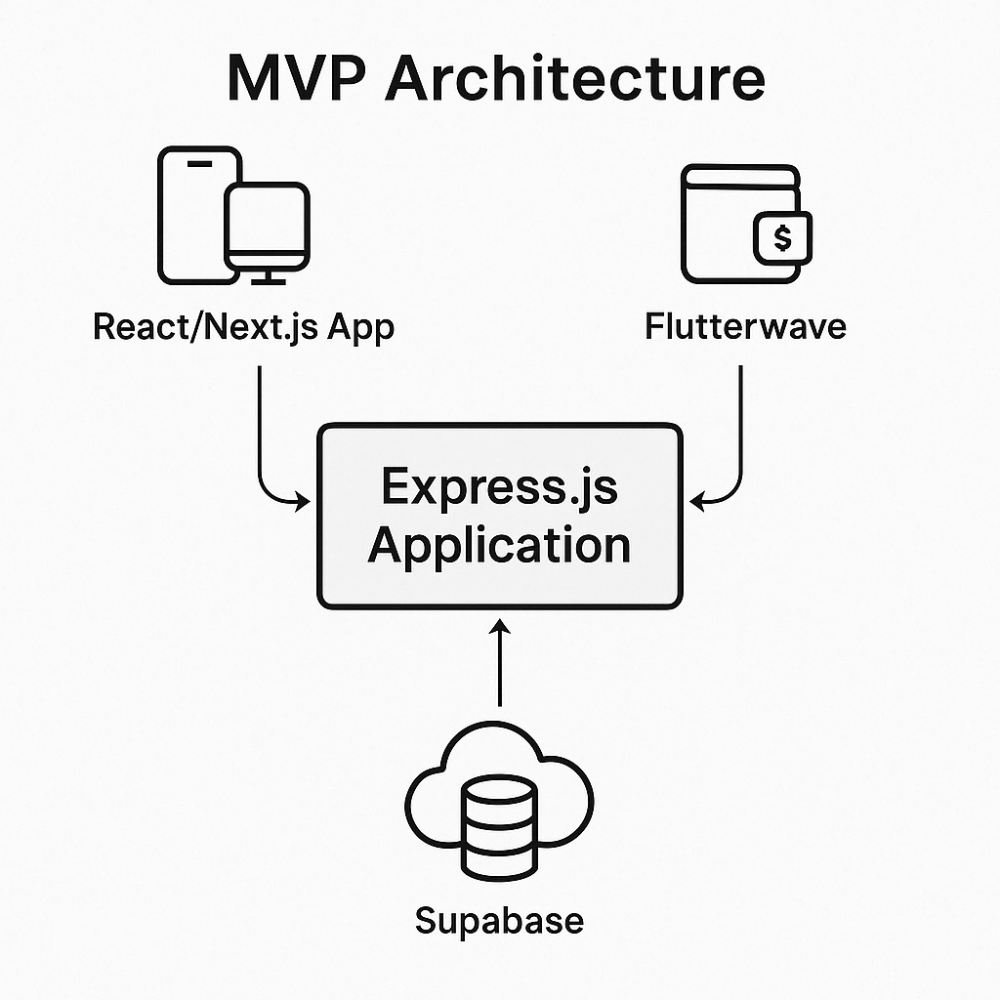
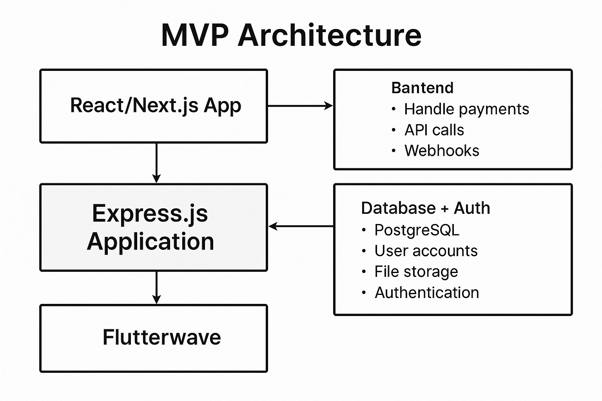
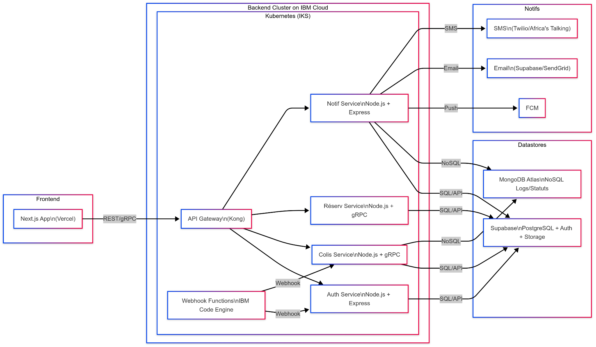

## **ARCHITECTURE DE LANCEMENT -- ENVOI DE COLIS (MVP) AVEC INFRA IBM**

### **1. Frontend -- Next.js (déployé sur Vercel)**

-   **Pourquoi Next.js** :

    -   Rapidité (SSR + SSG)

    -   Excellente expérience mobile (PWA)

    -   SEO friendly dès le départ

-   **Déploiement** :

    -   Vercel pour le moment (CDN intégré, CI/CD GitHub)

    -   Option migration future vers IBM Cloud Object Storage (si besoin
        > d'héberger toi-même)

### **2. Backend -- Node.js + Express.js + gRPC (Conteneurisé)**

-   **Architecture** : microservices conteneurisés en Node.js, avec gRPC
    > pour communication interne

-   **Microservices prévus** :

    -   Authentification / gestion utilisateurs

    -   Envoi de colis

    -   Réservations colis-voyageurs

    -   Notifications

-   **Déploiement** :

    -   **IBM Cloud Kubernetes Service (IKS)** pour orchestrer les
        > microservices

    -   Utilisation de **containers Docker** gérés via IKS

-   **API Gateway** :

    -   Kong (auto-scalable sur IBM Kubernetes)

    -   Sécurisé avec SSL + JWT

### **3. Base de données -- Supabase + MongoDB (hébergé séparément)**

-   **Supabase** (PostgreSQL) pour :

    -   Authentification (JWT, email/password, OTP)

    -   Stockage structuré des utilisateurs, colis, réservations

    -   Stockage de fichiers via Supabase Storage (photos, documents)

-   **MongoDB Atlas** (cloud) pour :

    -   Historique des statuts de colis (flexibilité)

    -   Logs, messages système

-   Supabase est hébergé à part (gestion BaaS), MongoDB clusteré,
    > multi‑régions possible

### **4. Notifications -- intégration directe**

-   **Firebase Cloud Messaging (FCM)** pour push mobile

-   **Supabase Email** ou **SendGrid** pour envois transactionnels

-   **Twilio ou Africa's Talking** pour les SMS (si besoin plus tard)

### **5. Infrastructure & DevOps -- 100% IBM Cloud au départ**

-   **Conteneurs & Orchestration** :

    -   IBM Cloud Kubernetes Service (IKS)

    -   Déploiement de chaque microservice dans un pod indépendant

-   **Serverless si besoin** :

    -   IBM Cloud Code Engine pour des fonctions ponctuelles (ex :
        > traitement webhook Flutterwave)

-   **Observabilité** :

    -   **IBM Log Analysis** + **Prometheus/Grafana** pour le suivi

-   **CI/CD** :

    -   GitHub Actions pour builder et déployer automatiquement sur IBM
        > Cloud

### **6. Scalabilité prévue (moyen et long terme)**

#### **À moyen terme :**

-   Migration progressive vers **AWS** pour :

    -   Accéder à un réseau de CDN plus étendu

    -   Avoir une plus large palette de services (SNS, DynamoDB, etc.)

#### **À long terme :**

-   Adoption du multi-cloud (IBM + AWS), en gardant Kubernetes comme
    > couche commune

-   Externalisation de certains services vers des solutions spécifiques
    > (paiement, logistique, IA)

### **STACK FINAL (VERSION IBM CLOUD)**

  -----------------------------------------------------------------------
  **Composant**             **Technologie choisie**
  ------------------------- ---------------------------------------------
  Frontend                  **Next.js** (déployé sur Vercel)

  Backend                   **Node.js + Express.js + gRPC**

  Auth + BDD                **Supabase** (auth, PostgreSQL, storage)

  Données non structurées   **MongoDB Atlas** (NoSQL, statuts/logs)

  Conteneurisation          **Docker**

  Orchestration             **IBM Kubernetes Service (IKS)**

  Notifications             FCM, Supabase Email, SendGrid (optionnel)

  Monitoring                IBM Log Analysis + Prometheus + Grafana

  API Gateway               **Kong** (sécurisé avec JWT)

  DevOps                    GitHub + CI/CD déploiement IBM Cloud
  -----------------------------------------------------------------------

Architecture MVP

{width="6.267716535433071in"
height="6.263888888888889in"}

{width="6.267716535433071in"
height="4.180555555555555in"}

Flowchart

{width="6.267716535433071in"
height="3.6527777777777777in"}

[[https://www.mermaidchart.com/app/projects/c227e9ad-ff03-497b-aaf6-1758570a48c6/diagrams/81b82287-5e36-402a-8684-f4478d3ca29a/version/v0.1/edit]{.underline}](https://www.mermaidchart.com/app/projects/c227e9ad-ff03-497b-aaf6-1758570a48c6/diagrams/81b82287-5e36-402a-8684-f4478d3ca29a/version/v0.1/edit)
